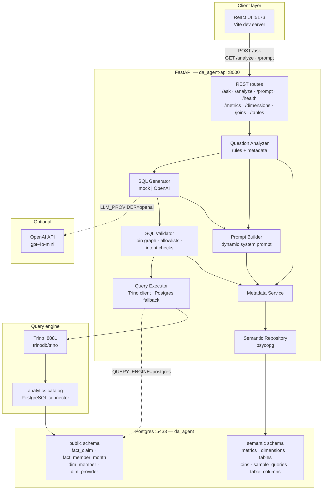
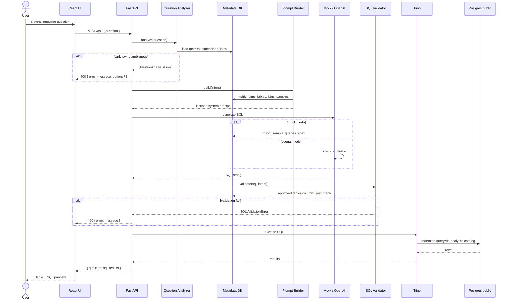
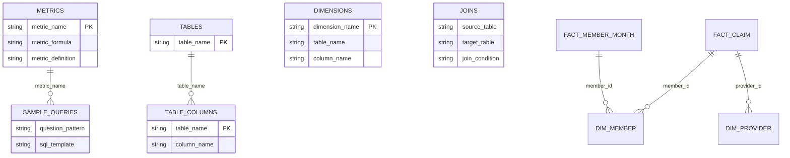
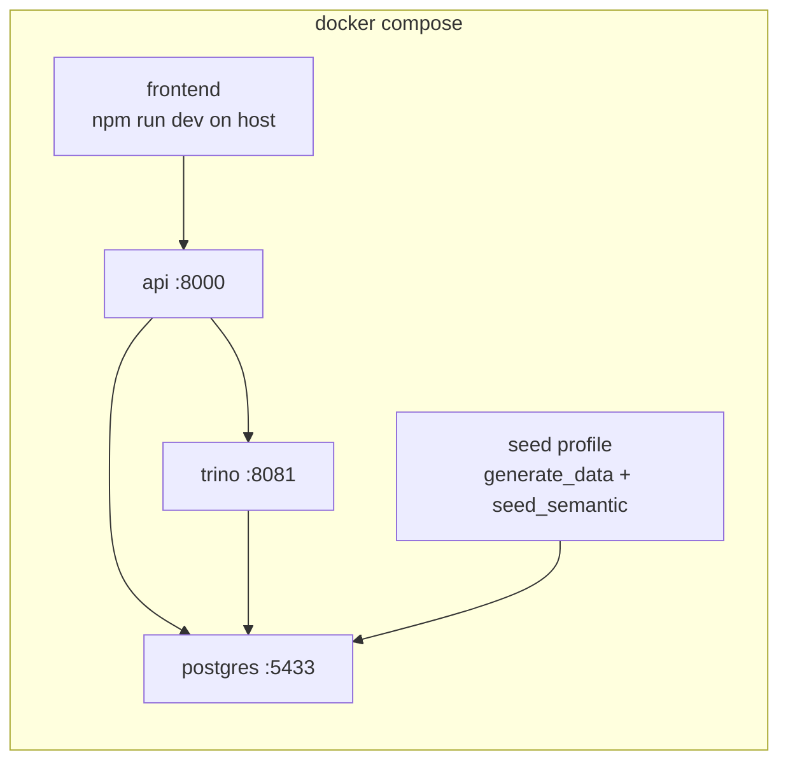

# Architecture

Current implementation on `main` (Phase 1 MVP + Phase 2 semantic layer).

## System overview

## Request flow (`POST /ask`)

## Semantic metadata model

## Docker deployment

## Component map

| Layer | Key paths |
|-------|-----------|
| UI | `frontend/src/App.tsx` |
| API entry | `backend/app/main.py` |
| Question analyzer | `backend/app/services/question_analyzer.py` |
| Metadata | `backend/app/services/metadata_service.py`, `backend/app/repositories/semantic_repo.py` |
| Prompt builder | `backend/app/services/prompt_builder.py` |
| SQL generator | `backend/app/services/sql_generator.py` |
| SQL validator | `backend/app/services/sql_validator.py`, `backend/app/services/join_graph.py` |
| Query executor | `backend/app/services/query_executor.py` |
| Analytics seed | `backend/scripts/generate_data.py`, `backend/scripts/init_db.sql` |
| Semantic seed | `backend/scripts/seed_semantic.py`, `backend/scripts/init_semantic.sql` |
| Trino catalog | `trino/catalog/analytics.properties` |
| Infra | `docker-compose.yml` |
| Smoke tests | `scripts/verify_benchmarks.py` |
| Regression | `scripts/run_regression.py`, `tests/regression/` |

## Structured error codes

| Code | Stage |
|------|--------|
| `UNKNOWN_METRIC` | Question analyzer |
| `UNKNOWN_DIMENSION` | Question analyzer |
| `AMBIGUOUS_DIMENSION` | Question analyzer (UI offers dimension options) |
| `GENERATION_ERROR` | SQL generator |
| `INVALID_JOIN_PATH` | SQL validator |
| `METRIC_MISMATCH` | SQL validator |
| `DIMENSION_MISMATCH` | SQL validator |
| `VALIDATION_ERROR` | SQL validator (general) |
| `EXECUTION_ERROR` | Query executor |

## Related docs

- [README.md](../README.md) — setup and API usage
- [PHASE1_CHECKLIST.md](../PHASE1_CHECKLIST.md) — Phase 1 MVP status
- [PHASE2_CHECKLIST.md](../PHASE2_CHECKLIST.md) — Phase 2 semantic layer status
